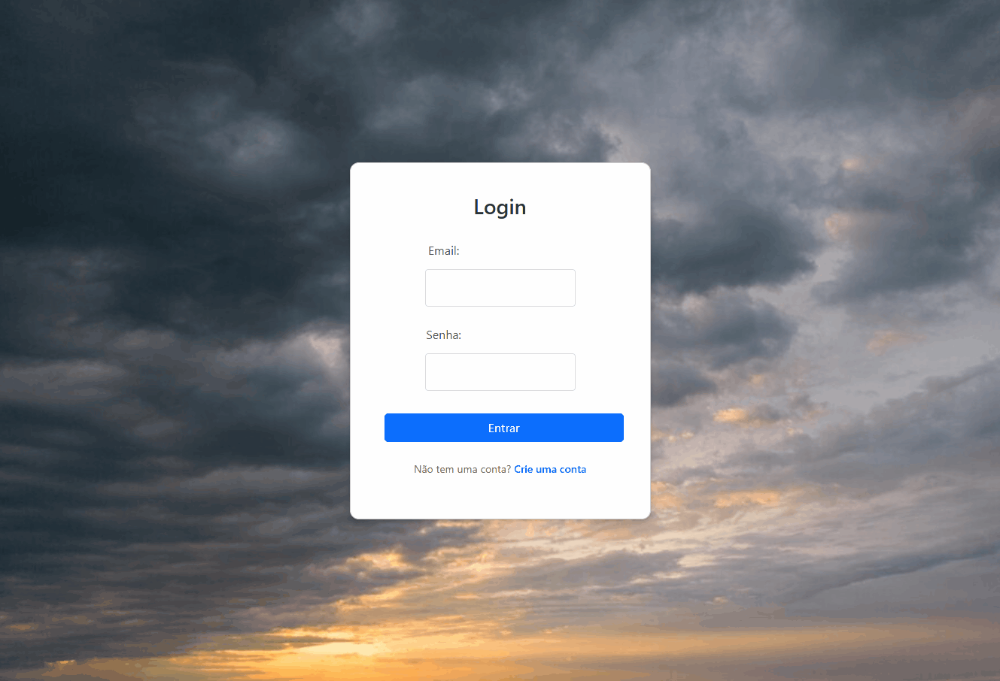

# WeatherWise 🌦️

> Sistema de consultas de previsão do tempo e histórico de consultas

✨ Demonstração
<div align="center">
  
</div>

## 📌 Índice

- [Sobre o Projeto](#sobre-o-projeto)
- [Funcionalidades](#funcionalidades)
- [Tecnologias Utilizadas](#tecnologias-utilizadas)
- [Estrutura de Arquivos](#estrutura-de-arquivos)
- [Padrões de Código](#padrões-de-código)
- [Instalação e Execução](#instalação-e-execução)
- [Configuração do Ambiente](#configuração-do-ambiente)

## 📋 Sobre o Projeto

WeatherWise é um sistema integrado para consulta e registro de previsões do tempo para diversas localidades. O projeto é dividido em duas partes principais:

- **Backend**: Desenvolvido com Laravel, responsável pelo gerenciamento de APIs e banco de dados
- **Frontend**: Criado em React, fornecendo uma interface interativa e intuitiva

Com o WeatherWise, os usuários podem consultar o clima de qualquer cidade brasileira usando CEP ou nome da cidade, além de poder comparar localidades e manter um histórico de consultas.

## ⭐ Funcionalidades

- 🔍 **Consulta de Clima**
  - Busca por CEP
  - Busca por nome da cidade
- 📊 **Histórico e Análise**
  - Armazenamento de previsões para consulta futura
  - Salvamento de consultas específicas
  - Comparação entre diferentes localidades
- 🔐 **Sistema de Usuários**
  - Autenticação completa
  - Histórico personalizado por usuário

## 🛠️ Tecnologias Utilizadas

### Backend
- Laravel 11 (PHP)
- PostgreSQL
- RESTful API

### Frontend
- React
- Axios
- React Hooks

### APIs Externas
- ViaCEP (consulta de CEP)
- Weatherstack (dados meteorológicos)

## 📁 Estrutura de Arquivos

### Backend (`/backend`)
```
├── app/
│   ├── Models/         # WeatherHistory, SavedQueries
│   └── Controllers/    # Lógica de controle
├── routes/
│   └── api.php        # Definição de endpoints
├── database/
│   └── migrations/    # Estrutura do banco
└── bootstrap/
    └── app.php       # Configuração central
```

### Frontend (`/front-react`)
```
├── src/
│   ├── components/   # Componentes reutilizáveis
│   ├── services/     # Configuração Axios
│   └── pages/        # Páginas principais
└── App.js           # Componente raiz
```

## 💻 Padrões de Código

### Backend
- Arquitetura MVC
- PSR-4 para autoloading
- API RESTful

### Frontend
- Componentização React
- Gerenciamento de estado com Hooks
- Requisições HTTP com Axios

 Foram utilizados nomes de váriaveis, funções e arquivos no padrão de nomenclatura em inglês.

## 🚀 Instalação e Execução

### Pré-requisitos

- Node.js >= 16.x
- Composer
- PostgreSQL

### Passos para Instalação

1. **Clone o Repositório**
```bash
git clone https://github.com/seu-usuario/weatherwise.git
cd weatherwise
```

2. **Configure o Backend**
```bash
cd backend
composer install
cp .env.example .env
```

3. **Configure o Frontend**
```bash
cd front-react
npm install
```

### Configuração do Ambiente

1. **Variáveis de Ambiente Backend** (.env)
```env
DB_CONNECTION=pgsql
DB_HOST=127.0.0.1
DB_PORT=5432
DB_DATABASE=weatherwise_db
DB_USERNAME=seu_usuario
DB_PASSWORD=sua_senha
```
2. Variáveis de Ambiente Frontend (.env)

```env

REACT_APP_API_KEY=sua_chave_api_weatherstack

```

> ⚠️ Importante: Para obter sua chave API do Weatherstack:

> 1. Acesse https://weatherstack.com/signup/free

> 2. Crie uma conta gratuita

> 3. Copie a chave API fornecida

> 4. Adicione a chave no arquivo .env do frontend

3. **Inicialização**
```bash
# Backend
cd backend
php artisan migrate
php artisan serve

# Frontend
cd front-react
npm start
```

Acesse:
- Frontend: http://localhost:3000
- Backend: http://localhost:8000

---

## 📝 Considerações Finais

O WeatherWise é um projeto em constante evolução. Contribuições são bem-vindas! Para contribuir, por favor crie um fork do repositório e submeta um Pull Request com suas alterações.

## 📄 Licença

Este projeto está sob a licença MIT. Veja o arquivo [LICENSE](LICENSE) para mais detalhes.
